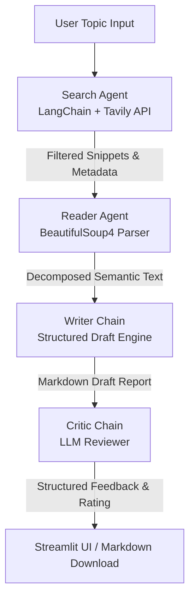

<div align="center">

# 🔬 PRISM

### **Parallelized Research & Information Synthesis Multi-agent System**

*A modular, extensible, and production-oriented multi-agent orchestration framework that automates concurrent web intelligence gathering, semantic content extraction, structured report synthesis, and automated peer-review criticism.*

[](https://www.python.org/)
[](https://github.com/langchain-ai/langchain)
[](https://streamlit.io/)
[](https://tavily.com/)
[](https://www.crummy.com/software/BeautifulSoup/)
[](#-solution-overview)
[](https://openai.com/)

---

[Features](#-key-features) · [Architecture](#-solution-overview) · [Installation](#-installation--configuration) · [Quick Start](#-quick-start-guide) · [Examples](#-example-output-workflow) · [Deployment](#-deployment-to-production) · [Roadmap](#-roadmap--future-improvements)

</div>

---

**PRISM** (Parallelized Research & Information Synthesis Multi-agent System) is a modular, extensible, and production-oriented multi-agent orchestration framework. It automates concurrent web intelligence gathering, semantic content extraction, structured report synthesis, and automated peer-review criticism. By splitting the research lifecycle across specialized agents and chains, PRISM aims to reduce hallucinations through structured retrieval, synthesis, and critique workflows.

---

## 🔍 Problem Statement

In the era of large language models, generating accurate, factual research reports remains a challenge due to:
1. **Information Overload & Noise**: Standard search engine results are cluttered with HTML boilerplate, navigation menus, ads, and interactive scripts.
2. **Context Window Waste**: Passing raw HTML content to LLMs is expensive, exhausts tokens, and degrades model attention.
3. **Factual Hallucinations**: Standard RAG pipelines lack independent verification, resulting in reports that may include unverified facts.
4. **Formatting Inconsistencies**: Generating reports with consistent sections (e.g., explicit citations, key findings, and scoring) is difficult to enforce deterministically without strict schema validation.

---

## 💡 Solution Overview

PRISM addresses these challenges through a sequential multi-agent orchestration pipeline. By decoupling information retrieval, deep reading, writing, and reviewing, PRISM improves factual grounding and structural consistency through multi-stage validation and critique loops:



- **Phase 1: Search Agent**: Executes parameterized search queries via the Tavily Search API, fetching metadata, URLs, and contextual snippets.
- **Phase 2: Reader Agent**: Selects the most promising resource from the search output and triggers a semantic DOM scraper to extract and sanitize raw text.
- **Phase 3: Writer Chain**: Compiles synthesized search snippets and deep scraped content into an organized, readable research document.
- **Phase 4: Critic Chain**: Inspects the generated report against scoring guidelines, delivering a numeric rating, strengths, weaknesses, and a final verdict.

---

## 🚀 Key Features

* **Autonomous Agent Delegation**: Powered by LangChain's pre-built agents to select URLs and format search queries dynamically.
* **Semantic HTML Scraper**: Leverages BeautifulSoup4 to decompose non-semantic tags (`<script>`, `<style>`, `<nav>`, `<footer>`), delivering high-signal context under 3,000 characters.
* **Structured Prompts**: Enforces specific templates for report drafting and critic reviews, ensuring output consistency.
* **Modern CSS UI**: A customized, dark-themed Streamlit interface featuring glassmorphic panels, real-time pipeline status trackers, and typography imports (Syne, DM Sans, DM Mono).
* **Fault-Tolerant Network Logic**: Implements custom request headers, timeouts, and exception handling for scraping robustness.

---

## 🛠️ Tech Stack

| Technology | Role | Description |
| :--- | :--- | :--- |
| **Python** | Core Language | Runtime and backend business logic. |
| **LangChain** | Agent Orchestration | Frame tool bindings and orchestrate agents. |
| **Streamlit** | Front-end Interface | Dynamic, styled UI for real-time orchestration tracking. |
| **Tavily API** | Web Intelligence | Advanced search engine optimized for LLM consumption. |
| **BeautifulSoup4** | HTML Parser | Semantic content cleaning and text extraction. |
| **Pydantic / OpenAI** | Structured Models | Handles schema-validation and core LLM inference (GPT-4o-mini). |

---

## 📂 Project Structure

```directory
Multi-agent-research-system/
├── app.py              # Custom-styled Streamlit application (Frontend)
├── pipeline.py         # Sequential CLI orchestration execution script
├── agents.py           # Agent builders, chains, and prompt configurations
├── tools.py            # Custom tool bindings (Tavily search & BeautifulSoup scraper)
├── requirements.txt    # Declared project dependencies
└── .gitignore          # Version control file exclusions
```

---

## ⚙️ Installation & Configuration

### Prerequisites
- Python 3.9 or higher
- Git

### 1. Clone the Repository
```bash
git clone https://github.com/sankalpbhosale0369-cell/PRISM.git
cd PRISM
```

### 2. Set Up Virtual Environment
On Windows (PowerShell):
```powershell
python -m venv venv
.\venv\Scripts\Activate.ps1
```
On macOS/Linux:
```bash
python3 -m venv venv
source venv/bin/activate
```

### 3. Install Dependencies
```bash
pip install -r requirements.txt
```

### 4. Configure Environment Variables
Create a `.env` file in the root directory:
```env
OPENAI_API_KEY=your_openai_api_key_here
TAVILY_API_KEY=your_tavily_api_key_here
```

---

## ⚡ Quick Start Guide

### Command Line Interface (CLI)
To run the automated research pipeline directly in your terminal:
```bash
python pipeline.py
```
*You will be prompted to enter a topic, and the system will stream the output of each phase directly to the terminal.*

### Streamlit Web UI
To run the high-fidelity graphical user interface:
```bash
streamlit run app.py
```
*Access the application by navigating to `http://localhost:8501` in your browser.*

---

## 📝 Example Output Workflow

Given the query: `"Recent advancements in Solid-State Battery technology"`

1. **Search Agent Output**: Gathers top 5 references containing URLs, titles, and snippets.
2. **Reader Agent Selection**: Automatically extracts text from the most relevant source (e.g., QuantumScape or Toyota battery research logs).
3. **Writer Chain Draft**:
   ```markdown
   # Introduction
   Solid-state batteries represent a paradigm shift in energy storage...
   
   # Key Findings
   - Anode-free designs using lithium metal foil...
   - Polymer and ceramic solid electrolyte progress...
   - Reduced thermal runaway risks compared to liquid lithium-ion...
   
   # Conclusion
   Commercial viability is targeting early-stage EV test runs by late 2026...
   
   # Sources
   - https://example-battery-journal.org/solid-state-breakthrough
   ```
4. **Critic Chain Review**:
   ```text
   Score: 8/10
   
   Strengths:
   - Clear distinction between solid-state types.
   - Cited credible automotive and scientific sources.
   
   Areas to Improve:
   - Needs more raw performance metrics (energy density in Wh/kg).
   
   One line verdict:
   A comprehensive overview of solid-state evolution with actionable insights.
   ```

---

## 🌐 Deployment to Production

### Streamlit Community Cloud
1. Push your repository to GitHub.
2. Sign in to [Streamlit Share](https://share.streamlit.io/).
3. Click **New App**, select your fork, branch `main`, and file path `app.py`.
4. Under **Advanced Settings**, paste your `.env` contents into the secrets section:
   ```toml
   OPENAI_API_KEY = "your_openai_api_key"
   TAVILY_API_KEY = "your_tavily_api_key"
   ```
5. Click **Deploy**.

---

## 🎯 Production Engineering Decisions

1. **Decoupled DOM Decomposition**: Instead of loading heavy web browsers, the scraper runs on `requests` with custom User-Agent mapping and an 8-second timeout, avoiding deadlocks.
2. **Context Compression**: HTML payloads are parsed to remove stylistic bloat and truncated to a max of 3,000 characters. This preserves the LLM context window and reduces latency.
3. **State Isolation**: Pipeline states are structured as serializable dictionaries, enabling transitions into database backends like PostgreSQL or Redis.
4. **Deterministic Prompting**: Output formatting is hardcoded inside prompt structures to guarantee correct parsing by downstream consumers.

---

## 🗺️ Roadmap & Future Improvements

- [ ] **Cyclic Routing (LangGraph Integration)**: Transition the sequential pipeline to a state-graph where the Critic can route execution back to the Writer if the evaluation score is below 7/10.
- [ ] **Asynchronous Concurrency**: Allow the Reader Agent to scrape the top 3 resources concurrently using `asyncio` to reduce execution latency.
- [ ] **Vector Database Retrieval**: Add ChromaDB or Pinecone integration to store scraped documents, allowing long-term semantic searches across research history.
- [ ] **Custom LLM Configs**: Allow users to configure temperature, max token limits, and fallback models directly from the UI sidebar.

---

## 👥 Maintainers

- **Developer / Maintainer**: [sankalpbhosale0369-cell](https://github.com/sankalpbhosale0369-cell)

---

## ⭐ Star Request

If you find PRISM useful, consider giving this repository a star! It helps support ongoing development and features. ⭐
